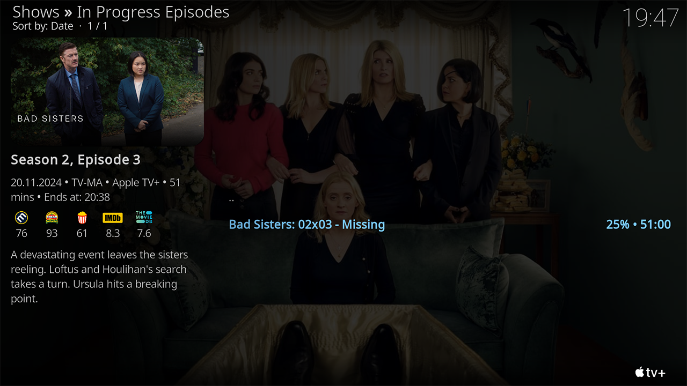
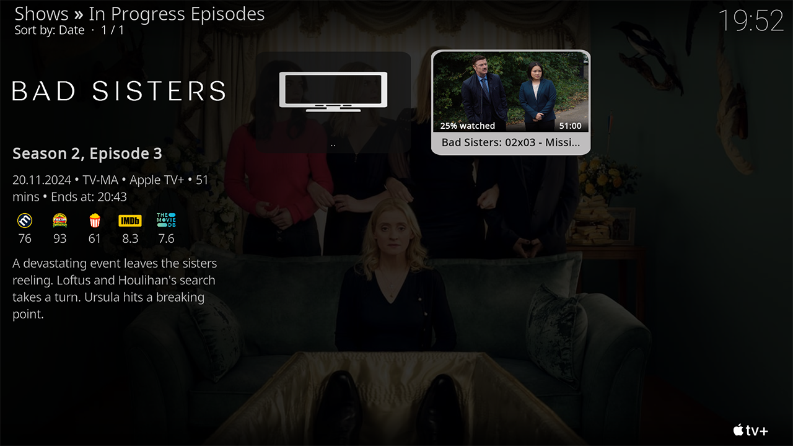
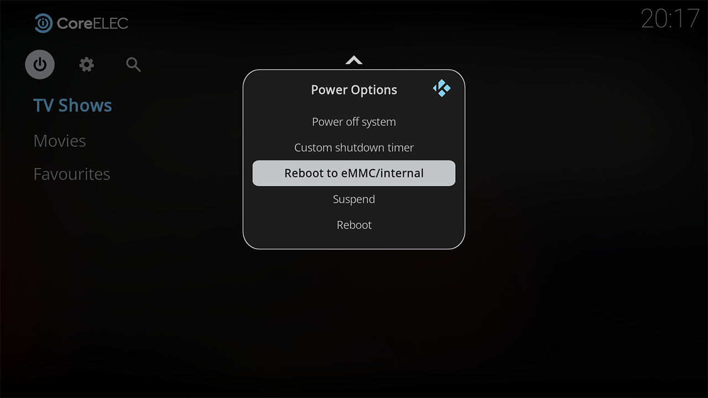

# FENtastic Skin fork for CoreELEC cpm build

Changes to the skin:
- WideList -> video duration + watched progress % is now shown on the right side of the list (also Youtube and other addons should now show video length)
- WideInfoWall -> video duration is now shown on the bottom right of the thumb image (also Youtube and other addons should now show video length); except for movies + watched progress % on the bottom left of the thumb image when thumb image is selected
- selected text is now blue instead of zoom (List View, Shift View, WideList, Home screen) 
- added 'Reboot to eMMC/Internal' to power menu
- added CoreELEC branding logo for home page
- added new brightness setting -> Lowest
- replaced skin setting button with CoreELEC in settings menu (skin setting still available via Interface-> Skin-> Configure skin... or via power button on home page)
- added CPM PlayerProcessInfo goodies from cpm.estuary skin (version is noted in the About github project description)
- maybe something else (check commits)

Please note that I do not accept requests. I am not a coder.

All credits go to the CoreELEC team, IvarBrandt, cpm and frodo19.

WideList

WideInfoWall

Home page + Reboot to eMMC/Internal

